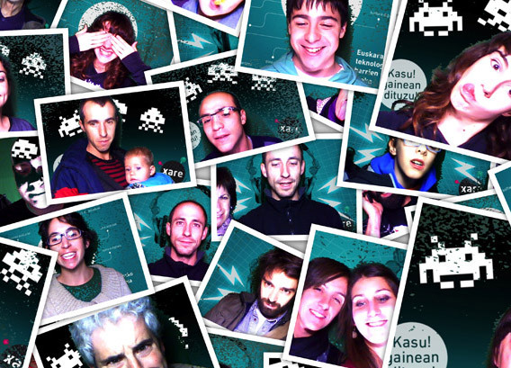

## Fotomaton 
### [En vivo](http://fotomaratoia.interzonas.info)

Proyecto basado en el proyecto [dvm](https://raw.github.com/rwldrn/dmv/) que como ponen en su descripción es esto: 
Node.js powered, Jitsu Hosted, WebRTC connected, 100% JavaScript, Camera > Web > Server Photobooth-style image capture program.

La idea del proyecto ha sido crear un fotomatón haciendo uso de la camara de la maquina mediante [html5](http://www.html5rocks.com/en/tutorials/getusermedia/intro/) que almacene las fotos en el servidor [nodejs](http://nodejs.org) pudiendolas mandar por correo [nodemailer](http://www.nodemailer.com/) y que se pudiera hacer un chroma key en el fondo para surtituirlo el chroma por las fotos (en este caso del evento [xare.eu](http://xare.eu) que es el que nos hizo el encargo) el chroma key lo hemos ralizado con [seriouslyjs.org](http://seriouslyjs.org) un proyecto brutal

El código es puro spaghetti western. Un día aprendere que la cocina japo mola mas con su rollo lean pero por ahora todo me sale rollo italiano. 

En la [demo](http://fotomaratoia.interzonas.info) el colorpicker permite elegir el color del chroma key, y cuando se pulsa a las imagenes se activa el chroma y los sustituye por la imagen elegida. Mediate [socket.io](http://http://socket.io/) mandamos al servidor tanto el buffer con la imagen del canvas modificada por seriously así como la info del correo. 

Este es el resultado:

Para cualquier cosa [@patxangas](http://twitter.com/patxangas)
[@aitor_rl](http://twitter.com/aitor_rl) se ha currado el diseño y que todo se vea en su sitio
y [txo](http://www.elurmaluta.net) de [eragin.com](http://eragin.com) responsables del evento es el diseñador de las imágenes.

Funciona con estos navegadores: [Canary](http://tools.google.com/dlpage/chromesxs), [Opera](http://dev.opera.com/articles/view/labs-more-fun-using-the-web-with-getusermedia-and-native-pages/) and [Opera Mobile 12](http://my.opera.com/chooseopera/blog/2012/02/27/opera-mini-7-next-and-opera-mobile-12). [Read More](http://weblog.bocoup.com/javascript-webrtc-opera-mobile-12/)
